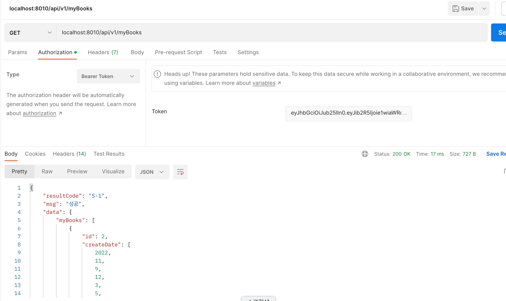
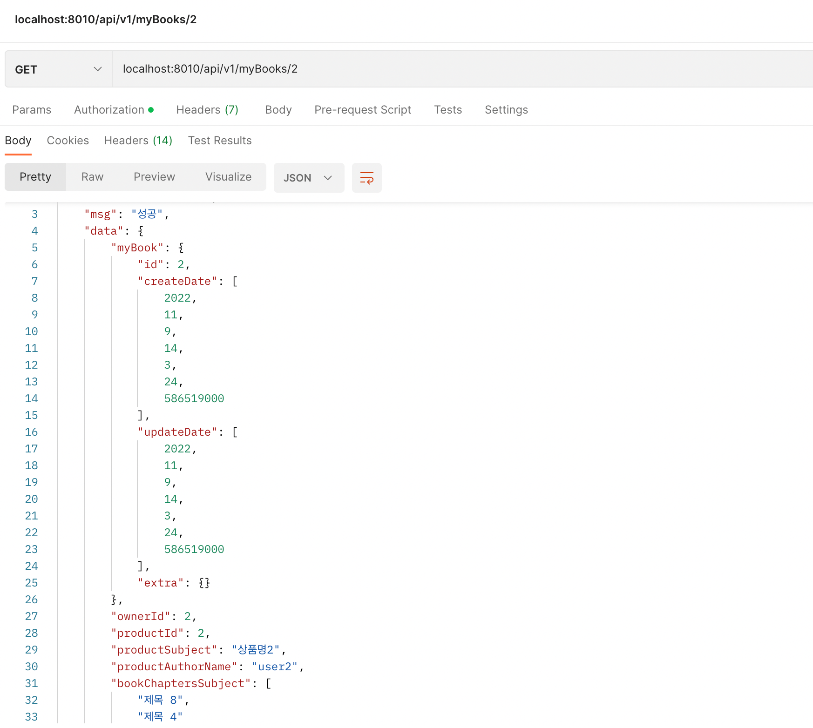

## Title: [4Week] 주민지

### 미션 요구사항 분석 & 체크리스트

---
#### 필수 기능
- [x] JWT 로그인 구현(POST /api/v1/member/login)
- [x] 내 도서 리스트 구현(GET /api/v1/myBooks)
- [x] 내 도서 상세정보 구현(GET /api/v1/myBooks/{id})
- [x] 로그인 한 회원의 정보 구현(GET /api/v1/member/me)
- [x] Srping Doc 으로 API 문서화(크롬 /swagger-ui/index.html )
#### 추가 기능
- [x] 엑세스 토큰 화이트리스트 구현(Member 엔티티에 accessToken 필드 추가)
- [ ] 리액트에서 작동되도록

### 4주차 미션 요약

---

##  I. 개발 도중 발생한 이슈 
### 1. 로그인 후 토큰 인증처리되지 않는 문제 [해결]
### Bug
로그인 후 인증 처리된 토큰 정보로 memberContext 생성하여  회원 정보 가져오는(requestURI=`/api/v1/member/me`) 테스트 실패
```
Range for response status value 403 expected:<SUCCESSFUL> but was:<CLIENT_ERROR>
필요:SUCCESSFUL
실제   :CLIENT_ERROR
```
### Bug Detail
```
MockHttpServletRequest:
      HTTP Method = POST
      Request URI = /api/v1/member/login
       Parameters = {}
          Headers = [Content-Type:"application/json;charset=UTF-8", Content-Length:"56"]
             Body = {
    "username": "user1",
    "password": "12341234"
}

    Session Attrs = {}

Handler:
             Type = com.ll.exam.Week_Mission.app.member.controller.ApiMemberController
           Method = com.ll.exam.Week_Mission.app.member.controller.ApiMemberController#login(LoginForm)

Async:
    Async started = false
     Async result = null

Resolved Exception:
             Type = null

ModelAndView:
        View name = null
             View = null
            Model = null

FlashMap:
       Attributes = null

MockHttpServletResponse:
           Status = 200
    Error message = null
          Headers = [Vary:"Origin", "Access-Control-Request-Method", "Access-Control-Request-Headers", Authentication:"..생략.. 인코딩된 토큰 값", Content-Type:"application/json", X-Content-Type-Options:"nosniff", X-XSS-Protection:"1; mode=block", Cache-Control:"no-cache, no-store, max-age=0, must-revalidate", Pragma:"no-cache", Expires:"0", X-Frame-Options:"DENY"]
     Content type = application/json
             Body = {"resultCode":"S-1","msg":"성공","data":{"accessToken":"..생략.. 인코딩된 토큰 값"},"success":true,"fail":false}
    Forwarded URL = null
   Redirected URL = null
          Cookies = []

MockHttpServletRequest:
      HTTP Method = GET
      Request URI = /api/v1/member/me
       Parameters = {}
          Headers = [Authorization:"Bearer ..생략.. 인코딩된 "]
             Body = null
    Session Attrs = {}

Handler:
             Type = null

Async:
    Async started = false
     Async result = null

Resolved Exception:
             Type = null

ModelAndView:
        View name = null
             View = null
            Model = null

FlashMap:
       Attributes = null

MockHttpServletResponse:
           Status = 403
    Error message = Access Denied
          Headers = [Vary:"Origin", "Access-Control-Request-Method", "Access-Control-Request-Headers", X-Content-Type-Options:"nosniff", X-XSS-Protection:"1; mode=block", Cache-Control:"no-cache, no-store, max-age=0, must-revalidate", Pragma:"no-cache", Expires:"0", X-Frame-Options:"DENY"]
     Content type = null
             Body = 
    Forwarded URL = null
   Redirected URL = null
          Cookies = []
```
### Code
```java
// JwtAuthorizationTest.java

    @Test
    @DisplayName("로그인 후 얻은 JWT 토큰으로 현재 로그인 한 회원정보 가져오기 (강제 세션 로그인 -> memberContext)")
    void t5() throws Exception {
        // When
        ResultActions resultActions = mvc
                .perform(
                        post("/api/v1/member/login")
                                .content("""
                                        {
                                            "username": "user1",
                                            "password": "12341234"
                                        }
                                        """.stripIndent())
                                .contentType(new MediaType(MediaType.APPLICATION_JSON, StandardCharsets.UTF_8))
                )
                .andDo(print());

        // Then
        resultActions
                .andExpect(status().is2xxSuccessful());

        var mvcResult = resultActions.andReturn();

        MockHttpServletResponse response = mvcResult.getResponse();

        String accessToken = response.getHeader("Authentication");

        resultActions = mvc
                .perform(
                        get("/api/v1/member/me")
                                .header("Authorization", "Bearer " + accessToken)
                )
                .andDo(print());

        // Then
        resultActions
                .andExpect(status().is2xxSuccessful())
                .andExpect(status().is2xxSuccessful())
                .andExpect(jsonPath("$.resultCode").value("S-1"))
                .andExpect(jsonPath("$.msg").value("성공"))
                .andExpect(jsonPath("$.data.id").value(2))
                .andExpect(jsonPath("$.data.createDate").isNotEmpty())
                .andExpect(jsonPath("$.data.updateDate").isNotEmpty())
                .andExpect(jsonPath("$.data.username").value("user1"))
                .andExpect(jsonPath("$.data.email").value("user1@meotbooks.com"))
                .andExpect(jsonPath("$.data.nickname").value("user1Author"))
                .andExpect(jsonPath("$.fail").value(false))
                .andExpect(jsonPath("$.success").value(true));
    }
```
```
// JwtProvider.java
@RequiredArgsConstructor
@Component
public class JwtProvider {
    private final SecretKey jwtSecretKey;
    private long tokenValidTime = 365 * 24 * 60 * 60 * 1000L; // 1년 // 365 * 24 * 60 * 60 * 1000 * 1 ms

    private SecretKey getSecretKey() {
        return jwtSecretKey;
    }

    public String generateAccessToken(Map<String, Object> claims) {
        Date now = new Date();

        return Jwts.builder()
                .claim("body", Ut.json.toStr(claims)) // JWT payload에 저장되는 정보 단위
                .setIssuedAt(now) // 토큰 발행시간
                .setExpiration(new Date(now.getTime() + tokenValidTime)) // 토큰 만료시간
                .signWith(getSecretKey(), SignatureAlgorithm.HS512) // Cause of Problem
                .compact();
    }

    /* 토큰 유효성 검증 */
    public boolean verify(String token) {
        try {
            Jwts.parserBuilder()
                    .setSigningKey(getSecretKey())
                    .build()
                    .parseClaimsJws(token);
        } catch (Exception e) {
            return false;
        }

        return true;
    }

    /* 토큰 claims -> map */
    public Map<String, Object> getClaims(String token) {
        String body = Jwts.parserBuilder()
                .setSigningKey(getSecretKey())
                .build()
                .parseClaimsJws(token)
                .getBody()
                .get("body", String.class);

        return Ut.json.toMap(body);
    }
   }
```
### Solution
1. Jwt 인증 필터 log.debug 로 로그 찍어봐도 원하는 내용이 출력되지 않아 해당 필터 자체가 안 먹는 현상인가 의심
   -> ApiSecurityConfig에 새로 도입한 CORS 의심
   ->  스프링시큐리티와 CORS 같이 사용시 생길 수 있는 문제(https://2step-hyun.tistory.com/112) 찾아보며 해결 시도
   -> 실패
2. 토큰은 제대로 헤더에 담겨오므로 이제 남은 건 토큰 인증과정에서의 문제라는 생각에 JwtProvider.getClaims() 코드 의심
   -> `parseClaimsJws(token)->.parseClaimsJwt(token)`로 변경 후 문제 임의 해결
3. **근본적 원인** : JwtProvider.generateAccessToken()에서 HS512 알고리즘으로 디지털 서명하는 코드(`.signWith(getSecretKey(), SignatureAlgorithm.HS512)`) 실수로 제거 
-> 다시 추가한 후에는 `parseClaimsJws(token)`로 토큰을 Jws로 파싱 가능
-> **문제 해결**
- [JWT와 JWS](https://escapefromcoding.tistory.com/255)
- [참고한 stackoverflow 1](https://stackoverflow.com/questions/42397484/jwt-signature-does-not-match-locally-computed-signature/42400145)
- [참고한 stackoverflow 2](https://stackoverflow.com/questions/61016123/io-jsonwebtoken-unsupportedjwtexception-signed-claims-jwss-are-not-supported)

### 2. 내 도서 리스트 및 상세페이지 조회 순환참조 [임의 해결]
### Bug
테스트 결과 MockHttpServletResponse은 200이 뜨나, 
```
Request processing failed; nested exception is org.springframework.http.converter.HttpMessageNotWritableException: Could not write JSON:
```
위와 같은 문제로 테스트 미통과

### Solution
현재 `@OneToMany` 관계에 있는 컬럼들은 `@JsonIgnore`처리했으나, 상세페이지 조회의 경우 요구사항 명세서대로 `ResponseEntity`에 외래키는 포함되지 않아 추가적으로 수정 필요


## II. 접근방법
새로운 프로젝트에서 시작하지 않고 스프링시큐티리 세션 로그인방식이 적용된 기존 프로젝트에서 작업을 시작하기도 했고, JWT를 이용한 로그인 구현이 아직은 익숙하지 않아 이슈들을 계속 생겼었습니다. 이번 주에는 다른 주차들에 비해 테스트 코드를 많이 작성해보며 TDD 방식으로 문제를 하나씩 해결해나갔고, PostMan으로 적절한 응답이 호출되는지 확인하며 개발 진행했습니다.
- **내 도서 리스트**

- **내 도서 상세페이지 조회**

